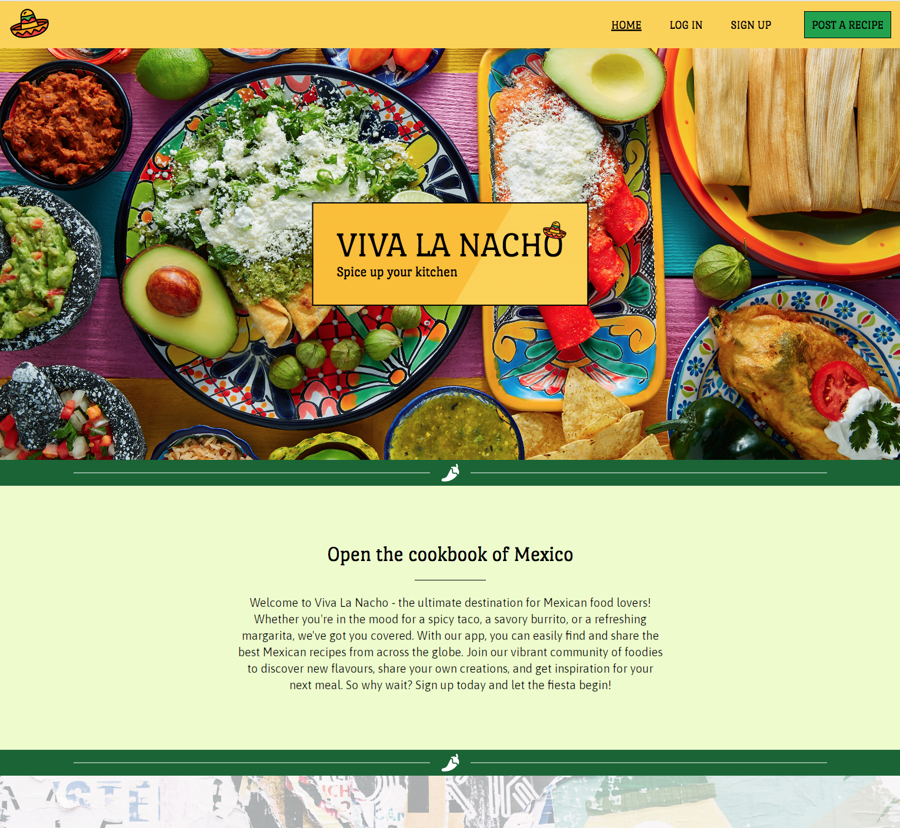

# **_Viva La Nacho_**

What it is. What it does. What is its purpose. Target audience. Intro. Keep it brief.

Link to the live site - [Viva La Nacho](https://viva-la-nacho.herokuapp.com/)

# Contents

* [**Project**](<#project>)
    * [Objective](<#objective>)
    * [Site User Goal](<#site-user-goal>)
    * [Site Owner Goal](<#site-owner-goal>)
    * [**Project Management**](<#project-management>)
        * [GitHub Project Board](<#github-project-board>)
        * [Database Schema](<#database-schema>)
* [**User Experience UX**](<#user-experience-ux>)
    * [Wireframes](<#wireframes>)
    * [User Stories](<#user-stories>)
    * [Site Structure](<#site-structure>)
    * [Colour Scheme](<#colour-scheme>)
    * [Typography](<#typography>)
* [**Features**](<#features>)
    * [**Existing Features**](<#existing-features>)
        * [**Homepage**](<#homepage>)
            * [Navigation](<#navigation>)
            * [Hero](<#hero>)
            * [Intro](<#intro>)
            * [Featured Recipe](<#featured-recipe>)
            * [Latest Recipes List](<#latest-recipes-list>)
            * [Most Popular Recipes List](<#most-popular-recipes-list>)
            * [Footer](<#footer>)
        * [**Authorisation**](<#authorisation>)
            * [Sign Up](<#sign-up>)
            * [Log In](<#log-in>)
            * [Log Out](<#log-out>)
        * [**Full Recipe Details**](<#full-recipe-details>)
            * [Recipe Details](<#recipe-details>)
            * [Like/Unlike Recipe](<#like-unlike-recipe>)
            * [Recipe Comments](<#recipe-comments>)
            * [Comment Form](<#comment-form>)
            * [Comment Form Validation](<#comment-form-validation>)
            * [Post Comment Notification](<#post-comment-notification>)
        * [**All Recipes**](<#all-recipes>)
            * [All Recipes List](<#recipe-cards>)
            * [Recipe Cards](<#recipe-cards>)
            * [Pagination](<#pagination>)
        * [**My Favourites**](<#my-favourites>)
            * [My Favourites List](<#my-favourites-list>)
            * [Unlike Recipe](<#unlike-recipe>)
            * [Unlike Recipe Notification](<#unlike-recipe-notification>)
            * [No Favourites](<#no-favourites>)
        * [**My Recipes**](<#my-recipes>)
            * [My Recipes List](<#my-recipes-list>)
            * [My Recipe Cards](<#my-recipe-cards>)
            * [Delete Recipe](<#delete-recipe>)
            * [Delete Recipe Notification](<#delete-recipe-notification>)
            * [No Recipes](<#no-recipes>)
        * [**Post A Recipe**](<#post-a-recipe>)
            * [Post Recipe Form](<#post-recipe-form>)
            * [Post Recipe Form Validation](<#post-recipe-form-validation>)
            * [Cancel Post Recipe Form](<#cancel-post-recipe-form>)
            * [Log In To Post Recipe](<#log-in-to-post-recipe>)
            * [Post Recipe Notification](<#post-recipe-notification>)
        * [**Edit Recipe**](<#edit-recipe>)
            * [Edit Recipe Form](<#edit-recipe-form>)
            * [Edit Recipe Form Validation](<#edit-recipe-form-validation>)
            * [Cancel Edit Recipe Form](<#cancel-edit-recipe-form>)
            * [Log In To Edit Recipe](<#log-in-to-edit-recipe>)
            * [Edit Recipe Notification](<#edit-recipe-notification>)
        * [**404 Page**](<#404-page>)
    * [**Future Features**](<#future-features>)
        * [Admin Area](<#admin-area>)
        * [User Profile](<#user-profile>)
        * [User Change Password](<#user-change-password>)
        * [Sign Up Email Confirmation](<#sign-up-email-confirmation>)
        * [Recipe Categories](<#recipe-categories>)
        * [Search Recipes](<#search-recipes>)
* [**Technologies Used**](<#technologies-used>)
    * [Languages](<#languages>)
    * [Frameworks](<#frameworks>)
    * [Software](<#software>)
    * [Libraries](<#libraries>)
* [**Testing**](<#testing>)
    * [**User Story Tests**](<#user-story-tests>)
    * [**Validator Tests**](<#validator-tests>)
        * [W3C (HTML)](<#w3c-html>)
        * [W3C (CSS)](<#w3c-css>)
        * [PEP8 (Python)](<#pep8-python>)
        * [JSHint (JavaScript)](<#jshint-javascript>)
    * [**Input Validation Tests**](<#input-validation-tests>)
        * [Post Recipe Form Tests](<#post-recipe-form-tests>)
        * [Edit Recipe Form Tests](<#edit-recipe-form-tests>)
        * [Comment Form Tests](<#comment-form-tests>)
    * [**Additional Tests**](<#additional-tests>)
        * [Manual Tests](<#manual-tests>)
        * [Automated Tests](<#automated-tests>)
        * [Responsive Tests](<#responsive-tests>)
        * [Browser Tests](<#browser-tests>)
        * [Lighthouse Tests](<#lighthouse-tests>)
        * [Wave Accessibility Tests](<#wave-accessibility-tests>)
    * [**Bugs**](<#bugs>)
        * [Resolved](<#resolved>)
        * [Unresolved](<#unresolved>)
* [**Deployment**](<#deployment>)
    * [**Project Deployment Via Heroku**](<#project-deployment-via-heroku>)
* [**Credits**](<#credits>)
    * [**Content**](<#content>)
    * [**Media**](<#media>)
    * [**Code**](<#code>)
*  [**Acknowledgements**](<#acknowledgements>)

# Project 

## Objective

[Back to top](<#contents>)

## Site User Goal

[Back to top](<#contents>)

## Site Owner Goal

[Back to top](<#contents>)

## Project Management

### Github Project Board

[Back to top](<#contents>)

### Database Schema

[Back to top](<#contents>)

# User Experience UX

## Wireframes

[Back to top](<#contents>)

## User Stories

[Back to top](<#contents>)

## Site Structure 

[Back to top](<#contents>)

## Colour Scheme

[Back to top](<#contents>)

## Typography 

[Back to top](<#contents>)

# Features

## Existing Features

### Homepage

[Back to top](<#contents>)

#### Navigation

[Back to top](<#contents>)

#### Hero

[Back to top](<#contents>)

#### Intro

[Back to top](<#contents>)

#### Featured Recipe

[Back to top](<#contents>)

#### Latest Recipes List

[Back to top](<#contents>)

#### Most Popular Recipes List

[Back to top](<#contents>)

#### Footer

[Back to top](<#contents>)

### Authorisation

#### Sign Up

[Back to top](<#contents>)

#### Log In

[Back to top](<#contents>)

#### Log Out

[Back to top](<#contents>)

### Full Recipe Details

#### Recipe Details

[Back to top](<#contents>)

#### Like/Unlike Recipe

[Back to top](<#contents>)

#### Recipe Comments

[Back to top](<#contents>)

#### Comment Form

[Back to top](<#contents>)

#### Comment Form Validation

[Back to top](<#contents>)

#### Post Comment Notification

[Back to top](<#contents>)

### All Recipes

#### All Recipes List

[Back to top](<#contents>)

#### Recipe Cards

[Back to top](<#contents>)

#### Pagination

[Back to top](<#contents>)

### My Favourites

#### My Favourites List

[Back to top](<#contents>)

#### Unlike Recipe

[Back to top](<#contents>)

#### Unlike Recipe Notification

[Back to top](<#contents>)

#### No Favourites

[Back to top](<#contents>)

### My Recipes

#### My Recipes List

[Back to top](<#contents>)

#### My Recipe Cards

[Back to top](<#contents>)

#### Delete Recipe

[Back to top](<#contents>)

#### Delete Recipe Notification

[Back to top](<#contents>)

#### No Recipes

[Back to top](<#contents>)

### Post A Recipe

#### Post Recipe Form

[Back to top](<#contents>)

#### Post Recipe Form Validation

[Back to top](<#contents>)

#### Cancel Post Recipe Form

[Back to top](<#contents>)

#### Log In To Post Recipe

[Back to top](<#contents>)

#### Post Recipe Notification

[Back to top](<#contents>)

### Edit Recipe

#### Edit Recipe Form

[Back to top](<#contents>)

#### Edit Recipe Form Validation

[Back to top](<#contents>)

#### Cancel Edit Recipe Form

[Back to top](<#contents>)

#### Log In To Edit Recipe

[Back to top](<#contents>)

#### Edit Recipe Notification

[Back to top](<#contents>)

### 404 Page

[Back to top](<#contents>)

## Future Features

### Admin Area

[Back to top](<#contents>)

### User Profile

[Back to top](<#contents>)

### User Change Password

[Back to top](<#contents>)

### Sign Up Email Confirmation

[Back to top](<#contents>)

### Recipe Categories

[Back to top](<#contents>)

### Search Recipes

[Back to top](<#contents>)

# Technologies Used

## Languages

[Back to top](<#contents>)

## Frameworks

[Back to top](<#contents>)

## Software

[Back to top](<#contents>)

## Libraries

[Back to top](<#contents>)

# Testing

## User Story Tests

[Back to top](<#contents>)

## Validator Tests

### W3C (HTML)

[Back to top](<#contents>)

### W3C (CSS)

[Back to top](<#contents>)

### PEP8 (PYTHON)

[Back to top](<#contents>)

### JSHint (JavaScript)

[Back to top](<#contents>)

## Input Validation Tests

### Post Recipe Form Tests

[Back to top](<#contents>)

### Edit Recipe Form Tests

[Back to top](<#contents>)

### Comment Form Tests

[Back to top](<#contents>)

## Additional Tests

### Manual Tests

[Back to top](<#contents>)

### Automated Tests

[Back to top](<#contents>)

### Responsive Tests

[Back to top](<#contents>)

### Browser Tests

[Back to top](<#contents>)

### Lighthouse Tests

[Back to top](<#contents>)

### Wave Accessibility Tests

[Back to top](<#contents>)

## Bugs

### Resolved 

[Back to top](<#contents>)

### Unresolved

[Back to top](<#contents>)

# Deployment

## Project Deployment via Heroku

This is a guide on how to deploy a project via [Heroku](https://www.heroku.com).

[Back to top](<#contents>)

# Credits

## Content

[Back to top](<#contents>)

## Media

[Back to top](<#contents>)

## Code 

[Back to top](<#contents>)

# Acknowledgements

[Back to top](<#contents>)