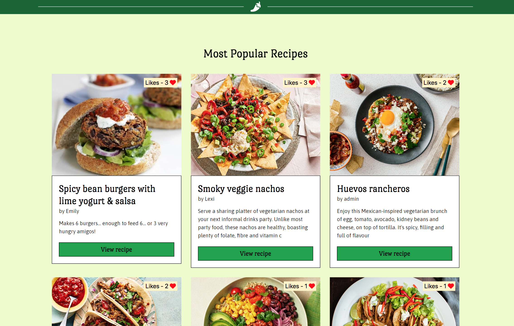
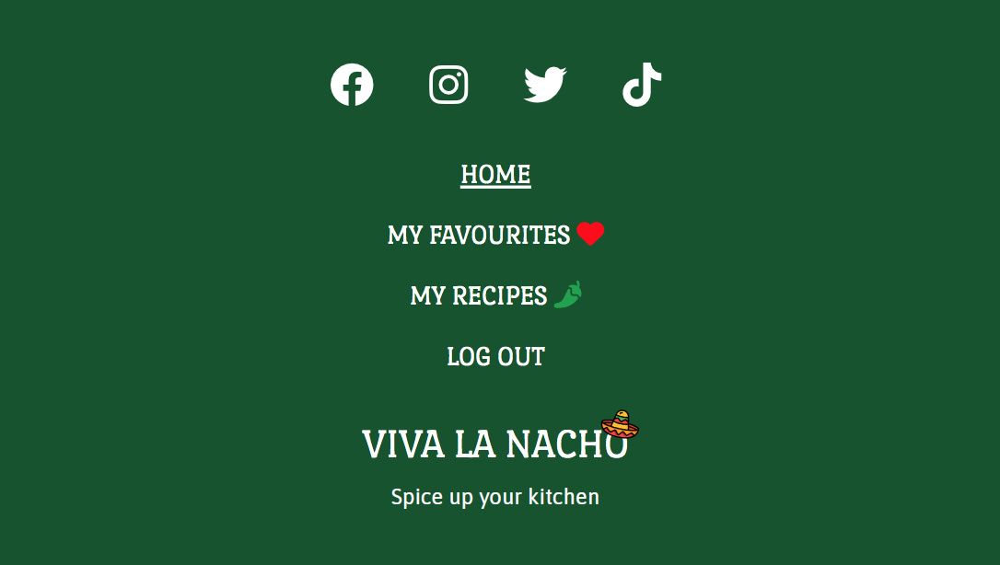
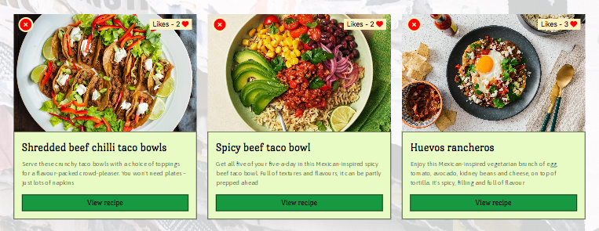
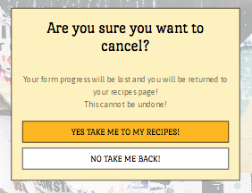

# **Viva La Nacho**

Viva La Nacho is a full stack web application that gives users a platform to view and share Mexican recipes. The intention of the site is to provide a simple, intuitive, visually appealing and user friendly platform for users to share Mexican inspired recipes and interact with the community. The intended target audience is anyone with an interest in cooking and Mexican food. The target audience will mostly span across men and women from young adults to older generations. 

The application impliments user authorisation and full CRUD functionality, allowing users to create, update, read and delete recipes stored in a relational database management system. Users can also like recipes to save them to their favourites list and interact with other users via recipe comments. 

The site also features a back end admin dashboard that allows an administrator to review and approve user comments, as well as monitor and edit recipes and users. 

Link to the live site - [Viva La Nacho](https://viva-la-nacho.herokuapp.com/)

# Contents

* [**Project**](<#project>)
    * [Objective](<#objective>)
    * [Site User Goal](<#site-user-goal>)
    * [Site Owner Goal](<#site-owner-goal>)
    * [**Project Management**](<#project-management>)
        * [GitHub Project Board](<#github-project-board>)
        * [Database Schema](<#database-schema>)
* [**User Experience UX**](<#user-experience-ux>)
    * [Wireframes](<#wireframes>)
    * [User Stories](<#user-stories>)
    * [Site Structure](<#site-structure>)
    * [Colour Scheme](<#colour-scheme>)
    * [Typography](<#typography>)
* [**Features**](<#features>)
    * [**Existing Features**](<#existing-features>)
        * [**Homepage**](<#homepage>)
            * [Navigation](<#navigation>)
            * [Hero](<#hero>)
            * [Intro](<#intro>)
            * [Featured Recipe](<#featured-recipe>)
            * [Latest Recipes List](<#latest-recipes-list>)
            * [Most Popular Recipes List](<#most-popular-recipes-list>)
            * [Footer](<#footer>)
        * [**Authorisation**](<#authorisation>)
            * [Sign Up](<#sign-up>)
            * [Log In](<#log-in>)
            * [Log Out](<#log-out>)
        * [**Full Recipe Details**](<#full-recipe-details>)
            * [Recipe Details](<#recipe-details>)
            * [Like/Unlike Recipe](<#like-/-unlike-recipe>)
            * [Recipe Comments](<#recipe-comments>)
            * [Comment Form](<#comment-form>)
            * [Comment Form Validation](<#comment-form-validation>)
            * [Post Comment Notification](<#post-comment-notification>)
        * [**All Recipes**](<#all-recipes>)
            * [All Recipes List](<#all-recipes-list>)
            * [Recipe Cards](<#recipe-cards>)
            * [Pagination](<#pagination>)
        * [**My Favourites**](<#my-favourites>)
            * [My Favourites List](<#my-favourites-list>)
            * [Unlike Recipe](<#unlike-recipe>)
            * [Unlike Recipe Notification](<#unlike-recipe-notification>)
            * [No Favourites](<#no-favourites>)
        * [**My Recipes**](<#my-recipes>)
            * [My Recipes List](<#my-recipes-list>)
            * [My Recipe Cards](<#my-recipe-cards>)
            * [Delete Recipe](<#delete-recipe>)
            * [Delete Recipe Notification](<#delete-recipe-notification>)
            * [No Recipes](<#no-recipes>)
        * [**Post A Recipe**](<#post-a-recipe>)
            * [Post Recipe Form](<#post-recipe-form>)
            * [Post Recipe Form Validation](<#post-recipe-form-validation>)
            * [Cancel Post Recipe Form](<#cancel-post-recipe-form>)
            * [Log In To Post Recipe](<#log-in-to-post-recipe>)
            * [Post Recipe Notification](<#post-recipe-notification>)
        * [**Edit Recipe**](<#edit-recipe>)
            * [Edit Recipe Form](<#edit-recipe-form>)
            * [Edit Recipe Form Validation](<#edit-recipe-form-validation>)
            * [Cancel Edit Recipe Form](<#cancel-edit-recipe-form>)
            * [Log In To Edit Recipe](<#log-in-to-edit-recipe>)
            * [Edit Recipe Notification](<#edit-recipe-notification>)
        * [**404 Page**](<#404-page>)
    * [**Future Features**](<#future-features>)
        * [Admin Area](<#admin-area>)
        * [User Profile](<#user-profile>)
        * [User Change Password](<#user-change-password>)
        * [Sign Up Email Confirmation](<#sign-up-email-confirmation>)
        * [Recipe Categories](<#recipe-categories>)
        * [Search Recipes](<#search-recipes>)
* [**Technologies Used**](<#technologies-used>)
    * [Languages](<#languages>)
    * [Frameworks](<#frameworks>)
    * [Software](<#software>)
    * [Libraries](<#libraries>)
* [**Testing**](<#testing>)
    * [**User Story Tests**](<#user-story-tests>)
    * [**Validator Tests**](<#validator-tests>)
        * [W3C (HTML)](<#w3c-html>)
        * [W3C (CSS)](<#w3c-css>)
        * [PEP8 (Python)](<#pep8-python>)
        * [JSHint (JavaScript)](<#jshint-javascript>)
    * [**Input Validation Tests**](<#input-validation-tests>)
        * [Post Recipe Form Tests](<#post-recipe-form-tests>)
        * [Edit Recipe Form Tests](<#edit-recipe-form-tests>)
        * [Comment Form Tests](<#comment-form-tests>)
    * [**Additional Tests**](<#additional-tests>)
        * [Manual Tests](<#manual-tests>)
        * [Automated Tests](<#automated-tests>)
        * [Responsive Tests](<#responsive-tests>)
        * [Browser Tests](<#browser-tests>)
        * [Lighthouse Tests](<#lighthouse-tests>)
        * [Wave Accessibility Tests](<#wave-accessibility-tests>)
    * [**Bugs**](<#bugs>)
        * [Resolved](<#resolved>)
        * [Unresolved](<#unresolved>)
* [**Deployment**](<#deployment>)
    * [**Project Deployment Via Heroku**](<#project-deployment-via-heroku>)
* [**Credits**](<#credits>)
    * [**Content**](<#content>)
    * [**Media**](<#media>)
    * [**Code**](<#code>)
*  [**Acknowledgements**](<#acknowledgements>)

# Project 

## Objective

This project was created as a fourth portfolio project submission for the Full Stack Software Development Higher National Diploma at [Code Institute](https://codeinstitute.net/). Amoungst other assessment criteria, the project had to be built using HTML, CSS, JavaScript, Python and Django and feature full CRUD functionality and user authorisation. The project had to also be planned and designed using agile methodologies. 

As a fan of not just Mexican food, but also food in general, I decided to create a Mexican recipe sharing app as it appealed to my interests, and I believed I would enjoy creating the application. I also believed I would genuinely consider using it personally going forwards, as a personal cookbook to store my own recipes. 

Due in part to a tight timeline for the project, I decided to keep the scope concise and well defined to aid in my goals, objectives and deliverables. I am a firm believer that it's better to do a good job at a few things rather than an average job at a lot of things. With this in mind, I focussed on implimenting an MVP with the core features necessary, in order to provide an attractive experience for the user with limited unnecessary features.

Put in its simplest form, the overall project objective of Viva La Nacho was this - create a full stack online application which allows users to sign up and create, edit and share Mexican recipes and interact with the community. I then refined this objective into epics, user stories and tasks using an agile methodology which provided me with a clear path to achieving my objective.

[Back to top](<#contents>)

## Site User Goal

Users of the Viva La Nacho application could have many goals. They may wish to gather and share knowledge related to Mexican food. They might want to interact and network with other users in the community who have shared interests. They could also want a platform to store their recipes, as well as gather and save new ones in a central location. Or it's possible they just want to browse the recipes casually without signing up. To make the application appealing to a vast audience, I have to try to create an application to cater to all of these potential user goals.

[Back to top](<#contents>)

## Site Owner Goal

As the site owner, the goal is to provide a stable and enjoyable user experience that encourages interaction and participation. The platform should be accessibile, welcoming and appealing to new users. Content should be high quality and well structured. User interactions should be monitored to maintain community standards. 

[Back to top](<#contents>)

## Project Management

### Github Project Board

An agile methodology was used to plan and design the Viva La Nacho application. A large part of this planning was done via the [Viva La Nacho GitHub Project Board](https://github.com/users/Matthew-Hurrell/projects/2). User stories were created on GitHub and added to the board in the todo section. They then moved across the board into in progress when they were being actioned, and then into the done section when they were completed. This helped greatly in tracking progress and organising and allocating work.

[Back to top](<#contents>)

### Database Schema

Database schemas were drawn up using [App Diagrams.net](https://app.diagrams.net/). The schemas were used to plan the database models and fields. It also helps to display the relationships between the models and how they interact. Viva La Nacho consists of three models - Recipe, Comment and User.

[Back to top](<#contents>)

# User Experience UX

## Wireframes

Wireframes were created using [Balsamiq](https://balsamiq.com/) to plan content flow and styling for Viva La Nacho. Some differences can be seen between the original wireframes and the finished product, and this is due to design choices made during the creative process.

### Home Page 

### Recipe Details

### Create Account

### Log In

### Log Out

### My Recipes

### My Favourites

### Post A Recipe

### Edit Recipe

[Back to top](<#contents>)

## User Stories

In terms of project management, user stories are an integral part of the software development creative process. Viva La Nacho consists of 43 user stories, each broken down into acceptance criteria and tasks. Each user story is also given a story points number relating to time/difficulty of the tasks and then is assigned a priority label of either 'must have', 'should have', 'could have' or 'wont have' to help organise work through iterations. User stories were created from 'Epics' which are larger over-arching features/concepts which are then refined down into smaller individual parts. Completed user stories were marked as closed. 

A full list of user stories can be found in the [Viva La Nacho GitHub Project Board](https://github.com/users/Matthew-Hurrell/projects/2).

[Back to top](<#contents>)

## Site Structure 

The Viva La Nacho app features a simple and user friendly site structure that users will be quite familiar with. However, some content is hidden / restricted to users who are not logged in. The main pages / templates of Viva La Nacho include - the home page, recipe full details, my favourites, my recipes, post recipe form, edit recipe form, all recipes and the sign up, log in and log out templates. Site users can freely and easily browse the various pages using the site navigation bar which is visible at the top and bottom of each page. The nav bar options automatically change depending on whether a user is signed in or not to allow for easy and intuitive site navigation.

[Back to top](<#contents>)

## Colour Scheme

The Viva La Nacho colour scheme was inspired by the [2016 WOW Fiesta Color Palette](https://www.color-hex.com/color-palette/17808) from [Color Hex](https://www.color-hex.com/). However, the actual colours used were from the selection of [Tailwind Colours](https://tailwindcss.com/docs/customizing-colors) from the [Tailwind Utility Framework](https://tailwindcss.com/) used to create the front-end of the site.

[Back to top](<#contents>)

## Typography 

Viva La Nacho uses [Google Fonts](https://fonts.google.com/) for the site typography. The specific fonts are [Port Lligat Slab](https://fonts.google.com/specimen/Port+Lligat+Slab?query=Port+Lligat+Slab) and [ASAP](https://fonts.google.com/specimen/Asap?query=asap). Port Lligat Slab is a display typeface. It is clear but defined with a clear Mexican inspired twist. It was chosen to add some character to the titles and links. It is a playful font and matches the theme well. Asap is a contemporary sans-serif font. It's modern looking and rounded, and it was used for the main bodies of text to make them easier to read. 

[Back to top](<#contents>)

# Features

## Existing Features

### Homepage

The homepage is the first page of the site that a user will see when they navigate to the [Viva La Nacho URL](https://viva-la-nacho.herokuapp.com/). It's designed to be eye catching to users and to quickly summarise the intention of the site. It is also a central location for all users to view recipes. 

[Back to top](<#contents>)

#### Navigation

Site navigation is present at all times on every page of the site in the form of footer and header nav bars. These navigational elements change depending on whether a user is logged in or not. Non logged in users only have access to the home page, recipe detail pages, view all recipe page and the log in and sign up page. These elements are also fully responsive and the header collapses to become a mobile menu on small screen sizes. The header nav features the site logo which is also a link back to the home page. It also features a post a recipe button which is distinctly different from the other nav menu items. This is to draw the users eye and encourage them to sign up so that they can use this feature. All nav menu items feature a scale and underline hover effect. Navigation items are active on the current page and the underline remains in place as a visual aid to show the user where they are.

[Back to top](<#contents>)

#### Hero

The homepage hero section is the large eye catching section which is just beneath the navigation bar. The hero is only displayed on the homepage. It is used to catch the users attention, and to clearly showcase the general topic of the site. It features a large, colourful full screen background image and a centralised text box with the site title and tagline. The hero section also features the mexican hat logo motif to reinforce the brand image.

[Back to top](<#contents>)

#### Intro

The homepage intro section is a brief introductory text paragraph that explains the purpose of the site and how to use it to new users. The section also features a divider above and below to clearly define and separate the sections. These stylised dividers are used frequently throughout the site and help to solidify the theme. A lighter shade of the green theme colour is used as a background colour.

[Back to top](<#contents>)

#### Featured Recipe

The featured recipe is the first recipe shown on the site homepage. This singular recipe has its own section and fills the entire width of the screen. The featured recipe can only be assigned by a site administrator. The general idea was that this would be cycled weekly/monthly for a new featured recipe. Unlike the other recipes on the page, the featured recipe displays the whole gallery of recipe images. It also displays information such as prep time, cooking time, difficulty, serving, the excerpt and the author username. There is a button link that takes the user to the full recipe details. There is also a like count displayed as a tag over the large recipe image. The background of the section is a colourful mexican wall full of torn posters but a gradient is used to fade the image so it doesn't distract from the recipe content.

[Back to top](<#contents>)

#### Latest Recipes List

The latest recipe list is a dynamic list of the latest recipes that have been uploaded to the site. When a new recipe is published, it will appear at the top of the list. Draft recipes do not appear in this list. Each recipe is displayed as a card. Each card has an image, a like count tag, a title, an author, an excerpt and a link to the full recipe page. The list displays a maximum of nine cards to avoid clutter. At the end of the section there is also a button link to the all recipes page. This section is fully responsive, and cards stack on top of each other on smaller screens. 

[Back to top](<#contents>)

#### Most Popular Recipes List

The most popular recipes list is another list styled similarly to the previous list. This list is ordered by recipes with the most likes. The list has a max of nine just like the previous list. At the bottom of this section is another view all recipes button link which takes the user to the all recipes page.

[Back to top](<#contents>)

#### Footer

The Viva La Nacho footer is present on every page of the site. It features the same navigation menu as the header nav but styled differently. A deep green background colour is used, which contrasts well with the light background colours of the inner sections. Social media icon links feature colour hover effects which match their individual social media colour palettes. There is also a repitition of the viva la nacho site name and tag line with the mexican hat motif to finish the page. This footer is fully responsive, and navigation items stack vertically on smaller screens.

[Back to top](<#contents>)

### Authorisation

#### Sign Up

A user can navigate to the sign up page via the site navigation bars if they are not logged in. The Viva La Nacho sign up page is a template from the [Django Allauth Package](https://django-allauth.readthedocs.io/en/latest/installation.html). Allauth provides the basic functionality for the user authorisation used in Viva La Nacho. However, the basic allauth templates have been heavily customised and styled to match the site design. The sign up page features a title and a sign up form with user input fields. The form also features javascript validation to alert the user if the fields are incorrectly filled out. The page also features another mexican food themed background image. The image is filtered to lighten the colours to prevent being too distracting to the user. Once a user submits the form correctly they are redirected back to the homepage as a logged in user.

[Back to top](<#contents>)

#### Log In

A user can navigate to the log in page via the site navigation bars if they are not already logged in. The styling of the log in page is very similar to the rest of the user authorisation pages. The colour scheme and background image are consistent, but the form and page heading are different. Once the log in form is submitted correctly the user is redirected to the homepage as a logged in user.

[Back to top](<#contents>)

#### Log Out

A user can navigate to the log out page via the site navigation bars if they are logged in. They are promted on this page to confirm they wish to log out. Upon confirmation the user is logged out and redirected to the homepage. If the user instead clicks the 'I'm still hungry' button they are just redirected back to the homepage but not logged out. The styling and background image is consistent with the other authorisation pages for coherence. 

[Back to top](<#contents>)

### Full Recipe Details

The full recipe details page is a template used to display the full information of a recipe. Each published recipe has a recipe details page. Theses pages are available for all users to view, including non logged in users. The main purpose of the page is to display the full recipe method and ingredients. Users will generally navigate to a full recipe page by clicking the view recipe button on the recipe card either on the home page or the all recipes page. As the user has now shown a specific interest in the recipe, all the information about the recipe is displayed here. 

#### Recipe Details

The first section of the recipe page features the recipe image. When there is more than one image a gallery of images is displayed underneath the main image. Basic recipe details and information is displayed in the top section such as cooking and prep time and allergens. There is also an icon on the image which allows the user to like the recipe. In the middle section there is two columns of text displaying the recipe ingredients and method. These fields are both summernote fields so they accept fully formatted and styled user text. Each section on the recipe details page is separated by a divider to clearly illustrate the different segments. 

[Back to top](<#contents>)

#### Like / Unlike Recipe

A user can like and unlike a recipe from that recipes specific recipe page. Each recipe features a heart icon in the top right corner of the main recipe image that can be clicked to like a recipe. It can also be clicked again to unlike a recipe. When a recipe is liked by a user, the icon changes to a heart with a minus icon. Unregistered users cannot like a recipe as they do not have a username. A user who is not logged in only sees a heart icon with a minus symbol to suggest it is blocked. Clicking the icon is disabled for an unregistered user and has no effect. 

[Back to top](<#contents>)

#### Recipe Comments

At the bottom of each recipe details page there is a comments section for users to post comments. Logged in users can use the comment form to post a comment to that particular recipe. Comments need to be approved by an admin before they appear on the site. Comments are listed in the admin area as unapproved and there is an action to approve comments in the admin actions menu. When comments are approved by the admin they immediately go live on the site and appear beneath the recipe. Comments are listed from the most recent at the top to the oldest at the bottom. The username of the comment author is displayed as well as the date and the body of the comment. 

[Back to top](<#contents>)

#### Comment Form

The recipe comment form is what the user uses to post a comment on a recipe. This comment form is only visible to logged in users as a username is required for a successful submission. The comment form comprises of one text body field for the comment and a submit button. The author is assigned automatically as well as the created on date. 

[Back to top](<#contents>)

#### Comment Form Validation

Javascript is used to validate the comment form. The form is checked for empty space as well as whitespace. Javascript provents the form from being submitted until the comment field passes the test. If the test fails, a pop-up notification appears on the users screen to advise them about the failure. The user can then rectify their mistake and submit the form again. When the comment form is filled out correctly the form submits successfully and the page is refreshed.

[Back to top](<#contents>)

#### Post Comment Notification

Upon the successful submission of the comment form, the page will refresh and a notification will appear at the top of the page. This notification advises the user that their comment has been successfully posted. The notification can be removed from view by clicking the x icon. If not manually hidden, the notification is automatically removed from view after three seconds. The form is also hidden from view in the comment section, and this is instead replaced by a short paragraph of text thanking the user for posting a comment. The text also advises the user that the comment will be visible after it has been approved. 

[Back to top](<#contents>)

### All Recipes

The all recipe page is a template that displays all the published recipes on the Viva La Nacho site. It was created later in production as there needed to be a single place for users to browse the full selection of recipes. This template has a maximum limit of nine recipes per page but features pagination to allow users to view more recipes. The page is styled very similarly to other pages and also includes the header nav and footer sections. 

#### All Recipes List

The recipes on the all recipes page are arranged in cards in columns of three on larger screens. The cards are responsive and stack on top of each other on smaller screens. The recipes are listed from latest to oldest order.

[Back to top](<#contents>)

#### Recipe Cards

Each recipe card includes a recipe image, recipe like count tag, title, author, excerpt and a button link to the full recipe. This makes it easy for a user to navigate to a recipe they are interested in. They can also see the like count to see if the recipe is popular. Cards are kept clean and are styled consistently with other recipe cards across the site.

[Back to top](<#contents>)

#### Pagination

A maximum of nine cards are visible on the all recipes page before page pagination occurs. The pagination menu is only visible if more than nine recipes exist on the Viva La Nacho site. Pagination is necessary to reduce load times and keep the page from being very large if a lot of recipes are published on the site. The user can click the next, previous, last or first buttons to navigate between pages of recipes.

[Back to top](<#contents>)

### My Favourites

The my favourites page is a template which is only accessible via the navigation menu to users who are logged in. The purpose of the my favourites page is to display a list of the recipes on the site which have been liked by the user. This is so the user can use liking recipes as a way of storing them to view at a later date, almost like putting a bookmark in a digital cookbook. Users can use this feature to keep their favourite recipes in one easy location without having to search for them manually on the all recipes page or home page.

#### My Favourites List

The my favourites recipe list displays published recipes that have been liked by the user. Recipes are displayed in cards which are styled consistently with recipe cards found throughout the site. The only difference is they also feature a red cross icon button which is displayed on the top left corner of the recipe image.

[Back to top](<#contents>)

#### Unlike Recipe

A user is able to quickly and easily unlike a recipe to remove it from the list on the my favourites page. The unlike button icon is on the top left corner of each recipe card. When a user clicks the unlike icon the content below the image is hidden and replace with a notification prompting the user to confirm their decision to unlike the recipe. This confirmation helps to avoid a user accidentally unliking a recipe. The user then has to confirm their decision by clicking the unlike button. Alternatively the user can click the cancel button to return the content to the recipe card and abort the process. Clicking the unlike button will remove the user like from the recipe and refresh the page with the recipe removed from the list.

[Back to top](<#contents>)

#### Unlike Recipe Notification

When a user unlikes a recipe from the my favourites page and the page is refreshed, a notification is displayed to the user at the top of the page confirming that the recipe has been unliked. This can be hidden by the user by clicking the x icon button. If the notification is not manually exited it will automatically be removed from view after three seconds. 

[Back to top](<#contents>)

#### No Favourites

If a user navigates to the my favourites page but has no liked recipes a content box appears which informs the user that they have no liked recipes. It also explains the purpose of the my favourites section, incase the user is unaware. There is also a button link in the box which navigates the user back to the homepage.

[Back to top](<#contents>)

### My Recipes

The purpose of the my recipes page is to display a list of the recipes that the current user has posted and is the author of. This list contains published and unpublished recipes and is only visible to the current logged in user. This page is not present in the navigation bars to non logged in users and can't be navigated to using the site navigation. The user can use the my recipes page to keep track of their recipes easily in one place. They can freely edit and delete any of their recipes from this page.

#### My Recipes List

The my recipes list displays a list of recipes that have been created by the user. It displays both published and unpublished user recipes. Recipes are again displayed in cards which are similarly styled to the recipe cards throughout the site. Cards are organised in columns of three on large screens and stack responsively to one column on smaller screens.

[Back to top](<#contents>)

#### My Recipe Cards

Recipe cards displayed on the my recipes page feature similar content to those seen throughout the rest of the site. They do however also include a drafted / published tag which displays to the user whether the recipe is drafted or not. They also contain edit, delete and view recipe buttons. Recipes which are drafted and unpublished do not contain the view recipe button as they do not have a full recipe template page until they are published.

[Back to top](<#contents>)

#### Delete Recipe

A user can delete their recipe easily from the my recipe page. If a user clicks the delete button on a recipe card the card content is hidden and a delete confirmation is displayed seeking confirmation from the user for recipe deletion. The user is also warned that the process cannot be undone. The user has the option to cancel the delete by clicking the cancel button or to confirm recipe deletion by clicking the delete button. The delete button is purposefully coloured red for warning. If the user clicks the cancel button the card content is returned to normal. If the user clicks the delete button the receipe is deleted from the database and the page is refreshed showing the recipe removed from the list.

[Back to top](<#contents>)

#### Delete Recipe Notification

If a user confirms the deletion of a recipe a notification is displayed to the user at the top of the page on refresh. This notification confirms the deletion of the recipe. The user can hide this notification by clicking the x icon. If the notification isn't manually closed the notification will automatically be removed from view after three seconds. 

[Back to top](<#contents>)

#### No Recipes

If a user navigates to the my recipes page but doesn't have any recipes a box is displayed in the centre of the screen to advise the user that they have no recipes. They are encouraged to post their first recipe and given a button link to the post a recipe form. There is also a button link to return home if the user doesn't want to post a recipe.

[Back to top](<#contents>)

### Post A Recipe

The post a recipe page template is a page which features a recipe form to enable users to submit a recipe to the Viva La Nacho site. The page is viewable by unauthenticated users but the form is hidden unless a user is logged in. The page features similar styling to the rest of the site for consistency and the header and footer nav menus are present for easy user navigation. 

#### Post Recipe Form

The recipe form is the main element of the post a recipe page. The form is contained in a centralised box and features a title, input fields and a username display, as well as a submit button and a cancel button. Form fields include text boxes, multiple checkboxes, number select fields, dropdown selects, image upload fields and WYSIWYG summernote fields. Required fields are marked with a red asterix. The form is fully responsive and the fields stack and become full screen on smaller screen sizes. There are a lot of fields required for a recipe post, so the fields are spaced out and organised to avoid confusion and clutter. 

[Back to top](<#contents>)

#### Post Recipe Form Validation

The recipe form user input is validated using javascript. A javascript event listener is used on the submit button to check all of the input fields for incorrect input. If any of the fields fail the tests the form is prevented from being submitted using the javascript prevent default function and a pop-up notification is displayed to the user which provides details of the field that failed and the error that occurred. The user then has the opportunity to rectify the error and submit the form again. The form will only submit to the database when all the fields pass the tests. This helps to prevent failed database submissions. Tests include checking for whitespace and also empty fields. There are also tests for the number fields to check that the user value isn't above a certain value. The summernote fields were slightly harder to validate as empty user input could still show HTML tags, which would pass the javascript test even with no user input. So to effectively validate these fields the strip HTML javascript function was created to remove HTML tags from the fields before testing. Checkboxes were also tested for any checked checkboxes by using the :checked selector and the javascript length function to check that the length of checked checkboxes was over 1. 

[Back to top](<#contents>)

#### Cancel Post Recipe Form

If a user clicks the cancel button on the post a recipe form at any point, the form content is hidden and a box containing a notification is displayed. The purpose of this notification is to get the user to confirm their choice to cancel the form. It is also explained that any form progress will be lost. If the user then clicks the home button they are redirected to the home page and the form progress is lost. If the user clicks the back button the box is hidden and the form is displayed with the current user input field values returned as previous. This process is to ensure that a user doesn't accidentally or unintentionally lose their form progress by navigating away from the page. This would be a bad user experience. 

[Back to top](<#contents>)

#### Log In To Post Recipe

The post recipe form page is available to both authorised and non authorised users. The button link to the page is available on the main nav bar to all users. The reason this button is still visible to non logged in users is it can be used as an incentive to encourage users to sign up. If site users aren't aware they can post their own recipes they may not decide to sign up for an account. This was an intentional design choice to boost user sign ups. However, non authorised users will not see the recipe form if they navigate to the post a recipe page. Instead they will be presented with a centralised content box which contains some text and button links. The notification advises the user that they need to be logged in to post a recipe. The user is then presented with three button links - one to the log in page, one to the sign up page and one for the home page. The user can then decide which option they would prefer. The log in and sign up page button links are deliberately kept brightly coloured to further encourage user sign ups and interaction. 

[Back to top](<#contents>)

#### Post Recipe Notification

When a user submits a recipe successfully the post a recipe page is refreshed and the form is hidden from view. A content box notification is displayed thanking the user for submitting their recipe. The box contains two button links - one to post another recipe, which refreshes the page and displays the recipe form again, and a home button which returns the user back to the home page. This process makes it easier for a user to post multiple recipes as they can be returned back to the recipe form with just one click. 

[Back to top](<#contents>)

### Edit Recipe

The edit recipe page is available to authorised users. The edit recipe page can be navigated to via the my recipes section. If a user has posted any recipes, the recipes will be available in a list on the my recipes section. Each of these recipes will feature an edit recipe button. When the edit recipe button is clicked the user is navigated to the edit recipe page. The page stying and content is exactly the same as the post a recipe page, including the recipe form. The only difference is the recipe form is pre filled out with the content from the specific instance of the recipe post. The user can then use this form to edit the content of their recipe post and submit the amendments to overwrite the recipe content.

#### Edit Recipe Form

As previously mentioned, the edit recipe form fields are pre filled out with content from the specific recipe instance. These fields are the same fields that are present in the post a recipe form and they are styled exactly the same, so the user should be familiar with the layout from when they submitted the recipe. All recipe content fields can be freely edited by the user. The user can also choose to draft or publish the recipe from this form. The form also contains a submit and a cancel button.

[Back to top](<#contents>)

#### Edit Recipe Form Validation

The edit recipe form features exactly the same validation as the post recipe form as the fields are identical. The code was refactored to change the form variable to include the edit recipe form when that form is on screen. It is important to still validate the edit recipe form, as althought the user has already submitted the recipe and it passed the tests on the first submission, if the fields are edited and content is removed and it is now not valid, the form is likely to fail when it is submitted to the database again. This is why the edit recipe form is still validated with javascript. The fields are all tested individually and if a test fails, the form is prevented from submitting and the user is presented with a pop-up notification which provides the user information on what field failed and why. When all the fields pass the tests the form is submitted to the database and the page is refreshed.

[Back to top](<#contents>)

#### Cancel Edit Recipe Form

If a user clicks the cancel button on the edit recipe form the form is removed from view and a centralised content box is displayed to the user prompting them to confirm their decision to cancel the form submission. The notification is identical to the one found on the post recipe form. It is also explained to the user that they will lose their form progress if they confirm the cancellation. The user is presented with two button links - one takes the user to the my recipes page and the other returns the user back to the form section. If a user clicks the cancel button the notification is hidden and the form is returned with the user form fields still in progress.

[Back to top](<#contents>)

#### Log In To Edit Recipe

During the process of creating the edit recipe page it occurred to me that some site users might try to edit recipes by manually entering the URL of the recipe into their browser URL bar. To defend against this I created a notification that hides the recipe form and displays a notification to the user if they visit the edit recipe page but they are not logged in. This notification prompts the user to sign up or log in to edit a recipe. It also provides them with a link to the home page to navigate away from the edit page. 

[Back to top](<#contents>)

#### Edit Recipe Notification

If a user successfully submits the edit recipe form the page is refreshed and the form is hidden. A centralised content box is displayed to the user which thanks them for editing their recipe and confirms the successful form submission. The user is then presented with a button link to the my recipes page and a button link to the home page for easy navigation away from the page.

[Back to top](<#contents>)

### 404 Page

[Back to top](<#contents>)

## Future Features

### Admin Area

[Back to top](<#contents>)

### User Profile

[Back to top](<#contents>)

### User Change Password

[Back to top](<#contents>)

### Sign Up Email Confirmation

[Back to top](<#contents>)

### Recipe Categories

[Back to top](<#contents>)

### Search Recipes

[Back to top](<#contents>)

# Technologies Used

## Languages

[Back to top](<#contents>)

## Frameworks

[Back to top](<#contents>)

## Software

[Back to top](<#contents>)

## Libraries

[Back to top](<#contents>)

# Testing

## User Story Tests

[Back to top](<#contents>)

## Validator Tests

### W3C (HTML)

[Back to top](<#contents>)

### W3C (CSS)

[Back to top](<#contents>)

### PEP8 (PYTHON)

[Back to top](<#contents>)

### JSHint (JavaScript)

[Back to top](<#contents>)

## Input Validation Tests

### Post Recipe Form Tests

[Back to top](<#contents>)

### Edit Recipe Form Tests

[Back to top](<#contents>)

### Comment Form Tests

[Back to top](<#contents>)

## Additional Tests

### Manual Tests

[Back to top](<#contents>)

### Automated Tests

[Back to top](<#contents>)

### Responsive Tests

[Back to top](<#contents>)

### Browser Tests

[Back to top](<#contents>)

### Lighthouse Tests

[Back to top](<#contents>)

### Wave Accessibility Tests

[Back to top](<#contents>)

## Bugs

### Resolved 

[Back to top](<#contents>)

### Unresolved

[Back to top](<#contents>)

# Deployment

## Project Deployment via Heroku

This is a guide on how to deploy a project via [Heroku](https://www.heroku.com).

[Back to top](<#contents>)

# Credits

## Content

[Back to top](<#contents>)

## Media

[Back to top](<#contents>)

## Code 

[Back to top](<#contents>)

# Acknowledgements

[Back to top](<#contents>)